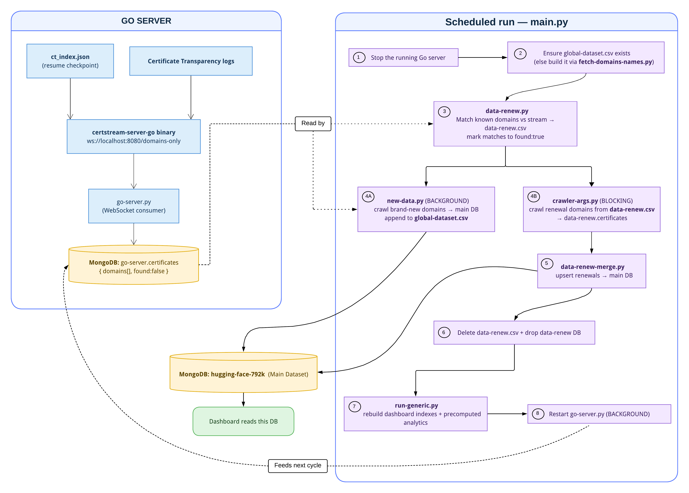
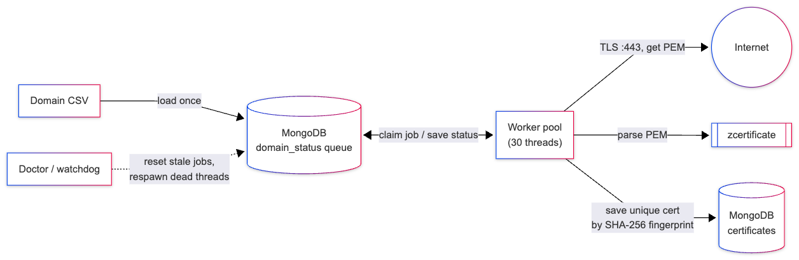

# FYP — SSL/TLS Certificate Ecosystem Analysis

A final‑year project that **collects SSL/TLS certificates at scale, keeps that collection fresh
automatically, and turns it into security analytics — all presented on an interactive, near real-time dashboard.** The work has a global view and a special
focus on Pakistan's (`.pk` / Pakistani IP space) certificate landscape.

The project is built from three interconnected pillars:

1. **Crawlers** — collect certificates from the internet, two ways: by **domain name** and by **IP range**.
2. **CT‑logs renewal pipeline** — an automation that watches **Certificate Transparency (CT) logs**
   so the dataset stays up to date (catches renewals and discovers brand‑new domains).
3. **Dashboard** — a Django + Next.js web app that visualizes everything (CA market share,
   encryption strength, validity, shared keys, vulnerabilities, and more).

## 🚀 Where to start

- **Run the dashboard:** See [`dashboard/README.md`](dashboard/README.md).
- **Understand the data renewal pipeline:** Read [The CT-logs renewal pipeline](#-the-ct-logs-renewal-pipeline).
- **Learn how certificates are collected:** Read [The certificate crawlers](#-the-certificate-crawlers).

> [!NOTE]
> **Platform compatibility**
>
> Unless stated otherwise, all commands in this README use Unix-style syntax (`python3` and forward-slash paths `/`).
>
> **Windows users:**
> - Replace `python3` with `python`.
> - You may use backslashes (`\`) instead of forward slashes (`/`) in file paths if you prefer.

<br>


## 📂 Repository structure

| Folder | What's inside | More info |
|---|---|---|
| **`dashboard/`** | The full‑stack analytics web app: Django backend (`backend/`) + Next.js frontend (`frontend/`). Reads certificates from MongoDB and renders them as interactive dashboard which shows all of the security analytics | [`dashboard/README.md`](./dashboard/README.md) |
| **`ct‑logs‑renewal‑pipeline/`** | The automation that keeps the dataset fresh by streaming Certificate Transparency logs, detecting certificate **renewals**, and ingesting **new** domains. | [CT-logs-renewal-pipeline](#-the-ct-logs-renewal-pipeline) |
| **`ssl-certificates-crawler/`** | The collectors. `domain-based-crawler/` connects to domains on port 443; `ip-based-crawler/` scans Pakistan's IP ranges. Both parse certs with [zcertificate](https://github.com/zmap/zcertificate) and store them in MongoDB. | [Certificate-crawler](#-the-certificate-crawlers) |
| **`binaries/`** | Pre-compiled executables required by the project. The certificate crawlers use [zcertificate](https://github.com/zmap/zcertificate) to parse SSL/TLS certificates, while the CT Logs Renewal Pipeline uses [certstream-server-go](https://github.com/d-Rickyy-b/certstream-server-go/releases) to stream Certificate Transparency (CT) logs. Download the executable for your operating system, place it in this `binaries/` folder, and rename it exactly to `zcertificate` and `certstream-server-go`. |
| **`useful-scripts/`** | Helper tools for database maintenance (remove raw field from dataset, remove fingerprint duplicate certificates , adds the scope field), checking CT log endpoint health, cleaning up domain CSV files, and preparing small test databases from a larger dataset. |
| **`assets/`** | Diagrams (Mermaid, Excalidraw, PNG), animations, and the project poster. |
| **`research-papers/`** | Reference papers that motivated the analyses |  |
| **`archive/`** | Older, superseded work kept for reference only. **Not used by the current system.** |  |

<br>

## 🔁 The CT logs renewal pipeline

📁 `ct-logs-renewal-pipeline/`

### What problem it solves

Certificates expire and get **renewed** constantly, and new domains appear every second. A dataset
collected once by the crawlers goes stale quickly. This pipeline keeps the main dataset
(`hugging-face-700k` in MongoDB) **continuously fresh** by tapping into **Certificate Transparency
(CT) logs** — public, append‑only logs that every modern CA must publish newly issued certificates to.

It does two jobs at once:

- **Renewals:** Continuously monitors domains that are already in our dataset.  When a renewed certificate issuance is detected in the CT stream for one of these domains, the system automatically triggers a fresh crawl and updates the database record, so our data stays up to date.
- **Discovery:** The pipeline also expands the dataset by discovering brand-new domains from the CT stream. During each scheduled run, it processes up to 10,000 newly discovered domains and adds their certificates to the main database. To increase or decrease this limit, modify the `EXTRACT_LIMIT` variable in [`new-data.py`](./ct-logs-renewal-pipeline/new-data.py).

### Pipeline Architecture

<table>
<tr>
<th>File</th>
<th style="min-width:550px">Role</th>
</tr>
<tr><td><code>main.py</code></td><td><strong>Orchestrator</strong>. Runs the full pipeline — renewal detection, new‑domain discovery, database updates, and analytics regeneration. Meant to run on a schedule (cron / Task Scheduler) so the dataset stays up to date.</td></tr>
<tr><td><code>go‑server.py</code></td><td>Manages the <strong><code>certstream-server-go</code></strong> binary — a compiled Go server connecting to CT logs, exposing a WebSocket (<code>ws://localhost:8080/domains-only</code>). Streams discovered domains into MongoDB (<code>go-server.certificates</code>, marked <code>found: false</code>).</td></tr>
<tr><td><code>config.yml</code></td><td>Configures the Go server: which CT log(s) to watch, buffer sizes, and crash recovery. Currently set to monitor all logs in the <a href="https://www.gstatic.com/ct/log_list/v3/log_list.json">Google Log list</a>, the same set used by Chrome.</td></tr>
<tr><td><code>ct_index.json</code></td><td><strong>Checkpoint file.</strong> Saves the last‑seen position per CT log so a restart resumes exactly where it left off.</td></tr>
<tr><td><code>fetch‑domains‑names.py</code></td><td style="white-space:nowrap">Builds the master domain list <code>global-dataset.csv</code> from the main MongoDB database.</td></tr>
<tr><td><code>data‑renew.py</code></td><td>Cross‑references <code>global-dataset.csv</code> against the live CT stream to find <strong>renewal candidates</strong> → writes <code>data-renew.csv</code>.</td></tr>
<tr><td><code>data‑renew‑merge.py</code></td><td>Merges freshly crawled renewal certificates into the main DB.</td></tr>
<tr><td><code>new-data.py</code></td><td>Pulls <strong>brand‑new</strong> domains from the stream, crawls them, inserts them into the main DB, and appends confirmed domains to <code>global-dataset.csv</code>.</td></tr>
<tr><td><code>global‑dataset.csv</code></td><td>The master domain list (<code>index,domain</code>).</td></tr>
</table>


### How the automation runs (the 8 steps in `main.py`)

Each scheduled run executes these steps **in order**. Steps 4A and 8 launch **background**
processes; everything else runs synchronously (blocking until done).



**In words:**

1. **Stop** the running Go server
2. **Ensure** the master domain list `global-dataset.csv` exists. In almost all cases, this file will already be present. However, if it is missing (e.g., during the very first run), the pipeline will automatically generate it from the database by running `fetch-domains-names.py`.
3. **Detect renewals** — `data-renew.py` compares domains in our dataset against the live CT stream to identify domains whose certificates have been renewed or replaced. Matching domains are written to `data-renew.csv` and marked as `found: true`.
4. **Crawl, two streams in parallel:**
   - **(A, background)** `new-data.py` takes *brand‑new* domains from the stream, crawls them, inserts
     them into the main database, and appends them to `global-dataset.csv`.
   - **(B, blocking)** the domain crawler (`crawler-args.py`) re‑crawls the *renewal* domains from
     `data-renew.csv` into a temporary `data-renew` database.
5. **Merge** the freshly crawled renewal certificates into the main database (`data-renew-merge.py`)
6. **Clean up** the temporary `data-renew.csv` file and `data-renew` database.
7. **Re‑compute** the dashboard's indexes and pre‑aggregated analytics (`run-generic.py`).
8. **Restart** the Go server so streaming continues for the next cycle.

No data is lost when the pipeline cycle stops the Go server. The `ct_index.json` file saves its exact position like a bookmark. Upon restart, it resumes streaming from where it left off.


### Dependencies & how to run

- **External:** a running **MongoDB** (default `localhost:27017`; to change the port or host, update `mongo_uri` in [`project-config.json`](project-config.json)), and the `certstream-server-go` binary. Download the build for your OS from the
   [releases page](https://github.com/d-Rickyy-b/certstream-server-go/releases/),
  place it in `binaries/`, then rename it to exactly `certstream-server-go`. Keep `config.yml` alongside.
- **Python packages:** `pymongo`, `psutil`, `websocket-client` (used by `go-server.py`).
  
  First, navigate to the correct folder:
  ```bash
  cd ct-logs-renewal-pipeline
  python3 main.py
  ```

  Logs are written under `logs/`. To run continuously, schedule `main.py` with cron / Task Scheduler.


## 🕷 The certificate crawlers

📁 `ssl-certificates-crawler/`

The project includes two complementary crawlers for collecting SSL/TLS certificates from the Internet:

- **Domain-based crawler** — connects to domain names on port **443**.
- **IP-based crawler** — scans IP ranges and connects directly to IP addresses on **443**.

Both perform a TLS handshake, extract the certificate, parse it into structured JSON using [`zcertificate`](https://github.com/zmap/zcertificate), and store the results in MongoDB. They intentionally accept expired, self-signed, and hostname-mismatched certificates because a security crawler should capture real-world deployments rather than only valid certificates.

```
domain list / IP list ──▶ TLS handshake (:443) ──▶ extract PEM certificate ──▶ zcertificate ──▶ JSON ──▶ MongoDB
```

### 1) Domain‑based crawler

📁 `ssl-certificates-crawler/domain-based-crawler/`

The domain-based crawler connects to domain names on port **443** and retrieves their SSL/TLS certificates. The production crawler is implemented in `src/crawler-args.py`, a multi-threaded, self-healing crawler designed for large-scale certificate collection.

> **Want to see the crawler output without running it?**
> Check [`data-sample.json`](data-sample.json), which contains a real parsed certificate document exactly as it is stored in MongoDB.

**How it works**

The crawler reads domains from a CSV file, loads them into a MongoDB-backed job queue, and distributes the workload across multiple worker threads (30 by default). Each worker establishes a TLS connection, extracts the certificate, parses it using the `zcertificate` binary, and stores the resulting JSON document in MongoDB. A watchdog ("doctor") thread continuously monitors workers activity and automatically reassigns stalled jobs, allowing the crawler to recover from unexpected failures without manual intervention. Duplicate domains are skipped automatically, ensuring the same domain is never crawled more than once.




**Configuration:**

By default, the crawler reads its MongoDB connection URI, target database, and input CSV file from [`project-config.json`](./project-config.json). The input CSV must follow the same format as [`global-dataset.csv`](./ct-logs-renewal-pipeline/global-dataset.csv). These three settings can be overridden individually using command-line arguments. All other options (such as the number of worker threads, retry behavior, and timeout values) use the default values defined in the crawler unless explicitly specified as command-line arguments.

**Common command-line arguments**

| Argument | Description |
|---|---|
| `--db-name` | Target MongoDB database |
| `--csv-file` | Path to the domain CSV file |
| `--num-threads` | Number of worker threads (default: 30) |
| `--mongodb-url` | MongoDB connection URI |
| `--retry-enabled` | Retry failed domains |
| `--max-retries` | Maximum retry attempts per domain |
| `--socket-timeout` | TLS handshake timeout |

Run the following command to see the complete list of supported options.

```bash
python3 crawler-args.py --help
```

### How to run:

**Navigate to the crawler directory**


```bash
cd ssl-certificates-crawler/domain-based-crawler/src
```


**Use the default configuration**

```bash 
python3 crawler-args.py
```

**Override the target database:**

```bash 
python3 crawler-args.py --db-name my-crawl
```

**Override the database and input CSV**

```bash 
python3 crawler-args.py --db-name my-crawl --csv-file ../datasets/pk-domains.csv --num-threads 30
``` 


**Other contents:**

| File / Folder | Purpose |
|---|---|
| `datasets/` | Contains [`pk-domains.csv`](ssl-certificates-crawler/domain-based-crawler/datasets/pk-domains.csv) together with the scripts used to extract .pk domains from multiple global datasets (see below).
| `mini‑dataset.csv` | Small dataset for testing and debugging. |


### Where the `pk-domains.csv` come from (`datasets/`): 

Because this project places a special focus on Pakistan's certificate landscape, we systematically extracted `.pk` domains from several large global datasets to build a highly targeted, localized collection.

We processed the following global sources:
* **Rapid7 Project Sonar** (~15.8 million domains)
* **Tranco Top Sites** (~4.62 million domains)
* **Cloudflare / Faculty Dataset** (~2 million domains)
* **Hugging Face Dataset** (~800,000 domains)

**The Extraction & Merging Process:**
1. We parsed all the datasets listed above to extract *only* the `.pk` domains.
2. We explicitly appended additional, known Pakistani government and critical infrastructure domains to ensure thorough coverage.
3. The extracted `.pk` domains from all sources were combined, deduplicated, and saved into a single file [`pk-domains.csv`](ssl-certificates-crawler/domain-based-crawler/datasets/pk-domains.csv) which was then merged into our main dataset `hugging-face-700k`


## 2) IP-based crawler

📁 `ssl-certificates-crawler/ip-based-crawler/`

Instead of starting from domain names, this crawler scans Pakistan's allocated IPv4 ranges directly by connecting to each IP address on port **443** to discover SSL/TLS certificates. This approach uncovers certificates that may not be reachable through conventional domain-based crawling.

**How it works**

The crawler reads a list of IPv4 CIDR blocks (or individual IP addresses), expands them into scan targets, performs a TLS handshake on port **443**, extracts the server's certificate, parses it using the `zcertificate` binary, and stores the resulting JSON document in MongoDB. The interactive version additionally allows you to choose whether to send a dummy Server Name Indication (SNI) value during the TLS handshake, which improves certificate discovery on virtual-hosted servers.

**Configuration**

Both `interactive-ip-crawler.py` and `static-ip-crawler.py` read their MongoDB connection URI, target database, and input CSV file from variables defined in the source code. Update these values before running the crawler.

**Scripts and data files**

| File / Data | Purpose |
|---|---|
| `interactive‑ip‑crawler.py` | Production crawler (40 worker threads). Supports both CIDR blocks and plain IP lists, optional dummy SNI, detailed error classification, and stores parsed certificates in MongoDB. |
| `static‑ip‑crawler.py` | Simplified crawler (20 worker threads) with fixed configuration for quick testing. |
| `apnic‑global‑to‑pk‑cidrs.py` | Extracts Pakistan's IPv4 allocations from the global [APNIC](https://ftp.apnic.net/apnic/stats/apnic/) registry and converts them into CIDR blocks. |
| `pk‑ip‑ranges.csv` | Complete list of Pakistan's IPv4 CIDR blocks used for full scans. |
| `pk‑ip‑ranges‑mini.csv` | Small subset of CIDR blocks for quick testing. |
| `results.txt` | Experimental results comparing scans with and without SNI, showing improved certificate discovery when using a dummy SNI value. |

**How to run**

Navigate to the crawler directory:

```bash
cd ssl-certificates-crawler/ip-based-crawler
```

(Optional) Regenerate the latest Pakistan IPv4 CIDR list from APNIC:

```bash
python3 apnic-global-to-pk-cidrs.py apnic-global.txt pk-ip-ranges.csv
```

Run the production crawler:

```bash
python3 interactive-ip-crawler.py
```

Or run the simplified crawler:

```bash
python3 static-ip-crawler.py
```

---

### 🛠 Tech Stack

| Area | Technologies |
|---|---|
| Certificate collection | Python (threading, `socket`, `ssl`), `zcertificate`, MongoDB |
| Certificate Transparency | `certstream-server-go`, WebSockets, CT Logs |
| Storage | MongoDB |
| Backend | Django 5, `pymongo`, optional Redis |
| Frontend | Next.js 16, React 19, TypeScript, Tailwind CSS v4, SWR, Recharts |


### ▶️ Quick start

1. Prepare a dataset by following the instructions in [`dashboard/README.md`](dashboard/README.md).
2. Start the dashboard.
3. (Optional) Schedule the CT renewal pipeline.


### ⭐ Closing note

This project was developed as a final-year undergraduate research project with the goal of building a scalable ecosystem for collecting, maintaining, and analyzing SSL/TLS certificates at scale. While the current implementation focuses on Pakistan's certificate landscape and has been validated on a dataset of over **800,000** real-world certificates, the architecture is designed to scale to significantly larger datasets with additional computing resources.

Contributions, suggestions, and feedback are always welcome.


### LICENSE
This project is licensed under the MIT License. See the [LICENSE](LICENSE) file for details.