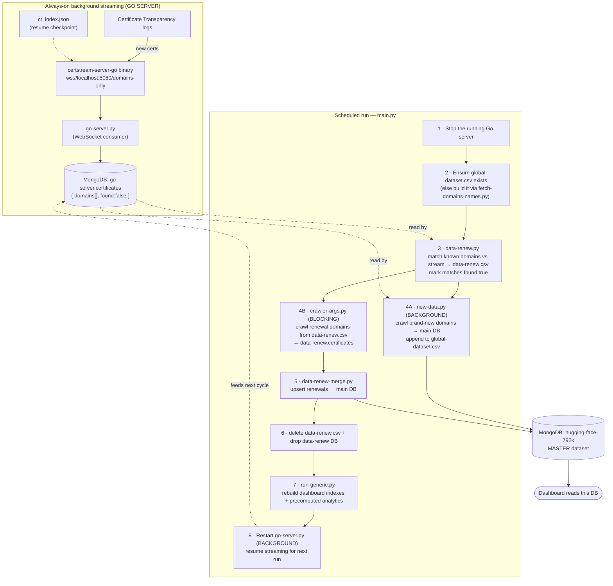
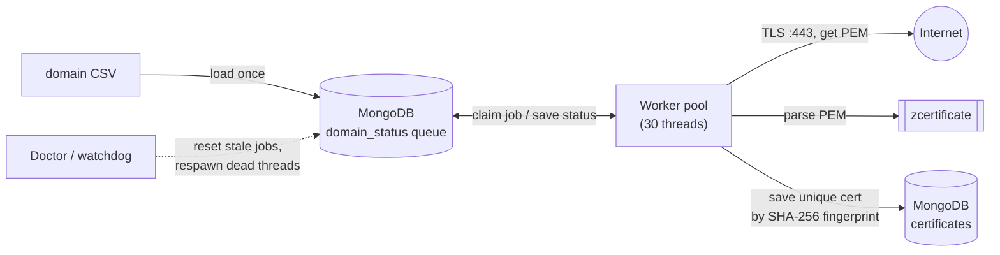
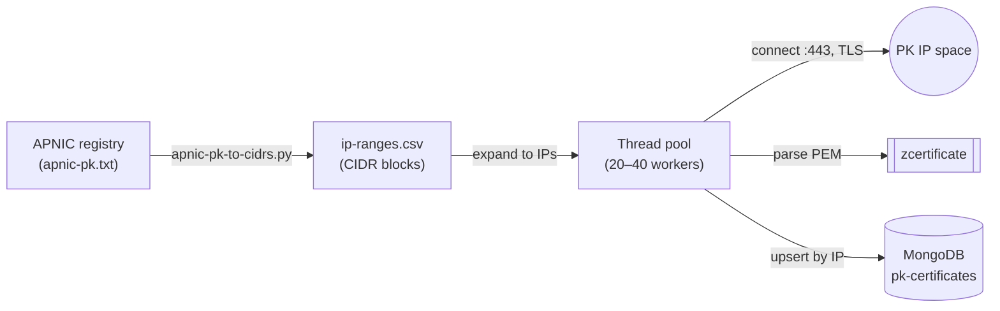

# FYP — SSL/TLS Certificate Ecosystem Analysis

<!--
  BADGES — notes / TODO (these reflect the repository's real state at setup time):
  • CI / Build: no GitHub Actions workflow exists yet. After adding one at
    `.github/workflows/ci.yml`, replace the static CI badge below with the live one:
    https://img.shields.io/github/actions/workflow/status/EbadJunaid/FYP/ci.yml?branch=main&logo=githubactions&label=CI
  • Release: no Git tag / GitHub Release exists yet, so the Release badge will render
    "no releases" until you publish one (e.g. `git tag v1.0.0 && git push --tags`).
  • License: no LICENSE file exists yet. After adding one (e.g. MIT), replace the static
    License badge below with the auto-detecting one: https://img.shields.io/github/license/EbadJunaid/FYP
  • This is a Python + TypeScript project (there is no C++/CMake), so the "programming
    language version" and "build system version" badges are mapped to the real toolchain:
    Python 3.11+, Node.js 18+, and Django 5.
-->

<!-- [](https://github.com/EbadJunaid/FYP/actions)
[](https://github.com/EbadJunaid/FYP/releases)
[](https://github.com/EbadJunaid/FYP/commits/main)
[](https://github.com/EbadJunaid/FYP/stargazers)
[](https://github.com/EbadJunaid/FYP)
[](https://www.python.org/)
[](https://www.typescriptlang.org/)
[](https://nodejs.org/)
[](https://www.djangoproject.com/)
[](https://nextjs.org/)
[](https://www.mongodb.com/)


 -->

A final‑year project that **collects SSL/TLS certificates at scale, keeps that collection fresh
automatically, and turns it into security analytics — all presented on an interactive, near real-time dashboard.** The work has a global view and a special
focus on Pakistan's (`.pk` / Pakistani IP space) certificate landscape.

The project is built from three interconnected pillars:

1. **Crawlers** — collect certificates from the internet, two ways: by **domain name** and by **IP range**.
2. **CT‑logs renewal pipeline** — an automation that watches **Certificate Transparency (CT) logs**
   so the dataset stays up to date (catches renewals and discovers brand‑new domains).
3. **Dashboard** — a Django + Next.js web app that visualizes everything (CA market share,
   encryption strength, validity, shared keys, vulnerabilities, and more).

<!-- ```
            ┌────────────────────────────────────────────────────────────┐
            │                    THE INTERNET                            │
            │   websites (port 443) · IP ranges · CT logs (Cloudflare…)  │
            └───────┬───────────────────┬──────────────────────┬─────────┘
                    │                   │                      │
       domain-based crawler     ip-based crawler        CT-logs renewal pipeline
       (Tranco/Rapid7/etc.)     (APNIC PK ranges)       (live stream + renewals)
                    │                   │                      │
                    └─────────┬─────────┴──────────┬───────────┘
                              ▼                    ▼
                     ┌────────────────────────────────────┐
                     │            MongoDB                  │
                     │  parsed certificates + analytics    │
                     └──────────────────┬─────────────────┘
                                        ▼
                               ┌──────────────────┐
                               │    Dashboard     │  Django API + Next.js UI
                               │  (charts/tables) │
                               └──────────────────┘
``` -->

> **Where to start:** To *run the website*, jump to [`dashboard/README.md`](./dashboard/README.md).
> To *understand the data pipeline*, read [The CT‑logs renewal pipeline](#-the-ct-logs-renewal-pipeline)
> and [The certificate crawlers](#-the-certificate-crawlers) below.

---

## 📂 Repository structure

| Folder | What's inside | More info |
|---|---|---|
| **`dashboard/`** | The full‑stack analytics web app: Django backend (`backend/`) + Next.js frontend (`frontend/`). Reads certificates from MongoDB and renders them as interactive dashboard which shows all of the security analytics | [`dashboard/README.md`](./dashboard/README.md) |
| **`ct‑logs‑renewal‑pipeline/`** | The automation that keeps the dataset fresh by streaming Certificate Transparency logs, detecting certificate **renewals**, and ingesting **new** domains. | [CT-logs-renewal-pipeline](#-the-ct-logs-renewal-pipeline) |
| **`ssl-certificates-crawler/`** | The collectors. `domain-based-crawler/` connects to domains on port 443; `ip-based-crawler/` scans Pakistan's IP ranges. Both parse certs with [zcertificate](https://github.com/zmap/zcertificate) and store them in MongoDB. | [Certificate-crawler](#-the-certificate-crawlers) |
| **`reports/`** | Standalone audit scripts (Python + MongoDB shell `.js`) that generate one‑off reports: certificate lifecycle, expired/expiring‑soon, hash & signature algorithms, SAN "blast radius", shared keys, ZLint errors/warnings. |  |
| **`figures-and-poster/`** | Project figures (Mermaid `.mmd`, Excalidraw, PNG) and the final **`poster.pdf`**. |
| **`research-papers/`** | Reference papers that motivated the analyses (RSA key reuse propagation, shared keys, stale certificates). |  |
| **`recordings/`** | Recording of the current running dashboard. |  |
| **`archive/`** | Older, superseded work kept for reference only. **Not used by the current system.** |  |

> **Note on data:** Large datasets, MongoDB dumps, crawler logs, and raw certificate sources are
> intentionally **not committed** (see `.gitignore`). The repo holds code, scripts, small sample
> CSVs, and documentation — you supply the data by running the crawlers or restoring a dump.

---

## 🔁 The CT‑logs renewal pipeline

📁 `ct-logs-renewal-pipeline/`

### What problem it solves

Certificates expire and get **renewed** constantly, and new domains appear every second. A dataset
collected once by the crawlers goes stale quickly. This pipeline keeps the master dataset
(`hugging-face-792k` in MongoDB) **continuously fresh** by tapping into **Certificate Transparency
(CT) logs** — public, append‑only logs that every modern CA must publish newly issued certificates to.

It does two jobs at once:

- **Renewals:** Continuously monitors domains that are already in our dataset. When a new certificate issuance is detected in the CT stream, the system automatically triggers a fresh crawl for that domain and updates its database record, ensuring our historical data doesn't go stale.
- **Discovery:** We expand our dataset daily by pulling brand-new domains from the CT stream. Due to compute limitations we cap this to 10k new domains per day.
>If you want to increase or decrease this daily limit, change the `EXTRACT_LIMIT` variable inside [new-data.py](./ct-logs-renewal-pipeline/new-data.py)

### Pipeline Architecture

| File | Role |
|---|---|
| `main.py` | **Orchestrator.** Runs the whole sequence in order (designed to be run on a schedule, e.g. cron). |
| `go-server.py` | Manages the **certstream‑server‑go** binary and streams discovered domains from CT logs into MongoDB (`go-server.certificates`, marked `found: false`). |
| `binaries/certstream-server-go_1.9.0_*` | The actual CT‑log listener (a compiled Go server). Connects to CT logs and exposes a WebSocket (`ws://localhost:8080/domains-only`).The executable currently bundled in this repository is for macOS. Please download the executable supported by your OS from the [Release page](https://github.com/d-Rickyy-b/certstream-server-go/releases/tag/v1.9.0) |
| `config.yml` | Configures the Go server: which CT log(s) to watch, buffer sizes, and crash recovery. Currently it is set to monitor all logs listed in the [Google Log list](https://www.gstatic.com/ct/log_list/v3/log_list.json) which are also included in the Chrome browser. |
| `ct_index.json` | **Checkpoint file.** Remembers the last‑seen index per CT log so a restart resumes instead of re‑downloading millions of certs. |
| `fetch-domains-names.py` | Builds the master domain list `global-dataset.csv` from the main MongoDB database.  |
| `data-renew.py` | Cross‑references `global-dataset.csv` against the live CT stream to find **renewal candidates** → writes `data-renew.csv` (with SAN de‑duplication). |
| `new-data.py` | Pulls **brand‑new** domains from the stream, crawls them, inserts into the main DB, and appends confirmed domains to `global-dataset.csv`. |
| `data-renew-merge.py` | Merges freshly crawled renewal certificates into the main DB. |
| `global-dataset.csv` | The master list which contains all domain names of our main dataset (`index,domain`). |
| `useful-scripts/` | Utility scripts used for database cleanup, auditing databases, and checking CT logs endpoints server health. |


### How the automation runs (the 8 steps in `main.py`)

Each scheduled run executes these steps **in order**. Steps 4A and 8 launch **background**
processes; everything else runs synchronously (blocking until done).



**In words:**

1. **Stop** any Go server still streaming from the previous cycle.
2. **Ensure** the master domain list `global-dataset.csv` exists (build it from MongoDB if it's the first run).
3. **Detect renewals** — `data-renew.py` compares known domains against the certificates the stream
   collected since last time, writes the matches to `data-renew.csv`, and marks them `found:true`.
4. **Crawl, two streams in parallel:**
   - **(A, background)** `new-data.py` takes *brand‑new* domains from the stream, crawls them, inserts
     them into the master DB, and appends them to `global-dataset.csv`.
   - **(B, blocking)** the domain crawler (`crawler-args.py`) re‑crawls the *renewal* domains from
     `data-renew.csv` into a temporary `data-renew` database.
5. **Merge** the freshly crawled renewal certificates into the master DB (`data-renew-merge.py`), with
   a checkpoint so it can resume if interrupted.
6. **Clean up** the temporary `data-renew.csv` file and `data-renew` database.
7. **Re‑compute** the dashboard's indexes and pre‑aggregated analytics (`run-generic.py`).
8. **Restart** the Go server so streaming continues for the next cycle.

Between runs, the **certstream‑server‑go** binary (driven by `go-server.py`) keeps listening to CT
logs and dropping discovered domains into `go-server.certificates`, using `ct_index.json` to resume
exactly where it left off after any restart.

<!-- ### Inputs & outputs

| Stage | Input | Output |
|---|---|---|
| Streaming | CT logs | `go-server.certificates` (MongoDB), `ct_index.json` |
| Renewal detection | `global-dataset.csv` + stream | `data-renew.csv` |
| Renewal crawl | `data-renew.csv` | `data-renew.certificates` (MongoDB) |
| Merge | `data-renew.certificates` | `hugging-face-792k` (updated) |
| New‑domain ingest | stream (`found:false`) | `hugging-face-792k` (appended) + `global-dataset.csv` (appended) | -->

### Dependencies & how to run

- **External:** a running **MongoDB** at `localhost:27017`, and the `certstream-server-go` binary in
  `binaries/` (the bundled build targets macOS; on Windows/Linux replace it with the matching release
  from the [certstream‑server‑go project](https://github.com/d-Rickyy-b/certstream-server-go) and keep `config.yml`).
- **Python packages:** `pymongo`, `psutil`, `websocket-client` (used by `go-server.py`).
- **Run a single cycle** (after MongoDB is up):
  ```bash
  # from ct-logs-renewal-pipeline/
  python main.py
  ```
  Logs are written under `logs/`. To run continuously, schedule `main.py` with cron / Task Scheduler.

---

## 🕷 The certificate crawlers

📁 `ssl-certificates-crawler/`

Two complementary collectors. Both perform a TLS handshake, grab the certificate the server presents,
parse it into structured JSON with the **`zcertificate`** binary (from the
[ZMap project](https://github.com/zmap/zcertificate)), and store the result in MongoDB. They
deliberately accept expired, self‑signed, and hostname‑mismatched certs (`CERT_NONE`) — as a crawler
you *want* to capture those.

```
domain list / IP list ──▶ TLS handshake (:443) ──▶ extract PEM ──▶ zcertificate ──▶ JSON ──▶ MongoDB
```

### 1) Domain‑based crawler

📁 `ssl-certificates-crawler/domain-based-crawler/`

Connects to **domain names** on port 443 and collects their certificates. The current production
crawler (V3) is multi‑threaded and self‑healing.

| Path | Purpose |
|---|---|
| `src/crawler.py` | **Current crawler (V3).** 30 worker threads, MongoDB‑backed job queue, a "doctor"/watchdog thread that recovers stuck jobs, live progress dashboard, fingerprint de‑duplication, adds a `scope` (TLD) field, drops the bulky `raw` field. Config is in‑code. |
| `src/crawler-args.py` | Same engine as `crawler.py` but **configurable via command‑line arguments** — this is the version the renewal pipeline calls. |
| `src/crawler-legacy.py` | Deprecated early version (kept for reference). |
| `archive/` | The evolution of the crawler (single‑thread → multi‑thread → file‑state → MongoDB‑state). See `archive/info.txt`. |
| `zcertificate/zcertificate` | The certificate‑parsing binary all crawlers shell out to. |
| `datasets/` | The domain lists and the scripts that build/merge them (see below). |
| `mini-dataset.csv`, `failed-domains.csv` | A tiny test list and a record of domains that failed to crawl. |

**How a worker thread runs:**



**Run it:**
```bash
# from domain-based-crawler/src/  — simple (in-code config)
python crawler.py

# configurable version
python crawler-args.py --db-name my-crawl \
  --csv-file ../datasets/final-dataset-mine/merged-pk-tranco-rapid-mini.csv \
  --num-threads 30
```

**Where the domain lists come from** (`datasets/`): the crawl targets are merged from several public
sources, then filtered/merged with helper scripts in each subfolder:

| Source | Folder | What it is |
|---|---|---|
| **Tranco** (~4.6M) | `datasets/tranco/` | A research‑grade "top sites" ranking. `tranco-pk-domains.py` filters it down to `.pk` domains. |
| **Rapid7 Project Sonar** (~15.8M) | `datasets/rapid-7/` | Massive public certificate/FDNS snapshots. `extract-domains-{1,2,3}.py` pull out the domain (common name) — `extract-domains-3.py` is the recommended hybrid (fast `cryptography` lib + `zcertificate` fallback). |
| **`.pk` domain registry** | `datasets/pk-domains-sir/` | Curated Pakistani domains. `unique-domains-from-csvs.py` / `merge.py` deduplicate and combine them. |
| **Merged output** | `datasets/final-dataset-mine/` | `merged-pk-tranco-rapid*.csv` — the final crawl lists (`index,domains`), with `mini` / `m` / full sizes. |

### 2) IP‑based crawler

📁 `ssl-certificates-crawler/ip-based-crawler/`

Instead of starting from domain names, this crawler scans **Pakistan's allocated IPv4 ranges**
directly — connecting to each IP on port 443 to discover certificates on hosts you'd never reach by
domain name alone.

| Path | Purpose |
|---|---|
| `static-ip-crawler.py` | Simple baseline: fixed config, `ThreadPoolExecutor` (20 workers), no SNI. |
| `interative-ip-crawler.py` | Advanced version (note: "interative" = *iterative*). Interactive prompts let you choose **CIDR vs plain‑IP** input and **whether to send an SNI**; 40 workers; distinguishes TCP‑level vs TLS‑level failures. |
| `apnic-pk-to-cidrs.py` | Converts the **APNIC** registry allocation format into clean CIDR blocks. |
| `apnic-pk.txt`, `apnic-complete.txt` | APNIC allocation data — Pakistan‑only and full registry. |
| `ip-ranges.csv`, `ip-ranges-mini.csv` | The generated CIDR lists fed to the crawler (full and test sizes). |
| `results.txt` | Notes from real runs (e.g., sending an SNI of `example.com` yielded ~45% more certificates than no SNI). |



**Prepare ranges & run:**
```bash
# from ip-based-crawler/
python apnic-pk-to-cidrs.py apnic-pk.txt ip-ranges.csv   # build CIDR list from APNIC data
python interative-ip-crawler.py                          # then answer the CIDR/IP + SNI prompts
# or the simple version:
python static-ip-crawler.py
```

### Crawler dependencies

- A running **MongoDB** at `localhost:27017`.
- The **`zcertificate`** binary (already under `domain-based-crawler/zcertificate/`).
- Python packages: `pymongo` (both), plus `pandas` / `cryptography` for some dataset‑prep scripts.

---

## 🛠 Tech stack (whole project)

| Area | Technologies |
|---|---|
| Data collection | Python (threading, `socket`/`ssl`), `zcertificate`, MongoDB |
| Live CT ingestion | `certstream-server-go`, WebSockets, Certificate Transparency logs |
| Storage | MongoDB (raw certificates + pre‑computed analytics) |
| Backend | Django 5, `pymongo`, optional Redis |
| Frontend | Next.js 16, React 19, TypeScript, Tailwind CSS v4, SWR, Recharts |
| Tooling (recommended) | **uv** for Python envs, **Bun** for the frontend |

---

## ▶️ Getting started

- **Run the dashboard (the website):** follow the step‑by‑step guide in
  [`dashboard/README.md`](./dashboard/README.md). You'll need MongoDB populated with certificate data.
- **Collect certificates:** run the crawlers in [`ssl-certificates-crawler/`](#-the-certificate-crawlers).
- **Keep data fresh:** schedule [`ct-logs-renewal-pipeline/main.py`](#-the-ct-logs-renewal-pipeline).

> Prerequisite for everything: a running **MongoDB** instance at `localhost:27017`.
